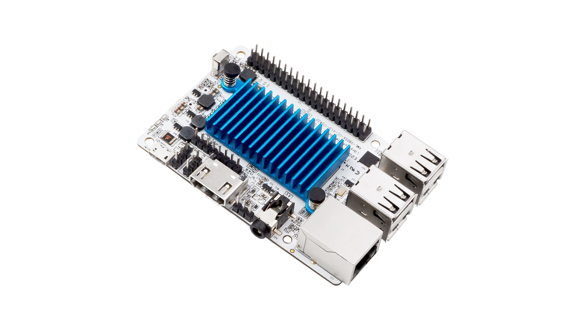
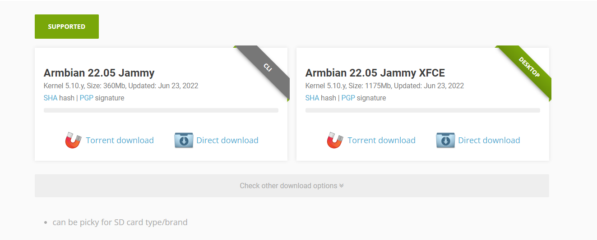
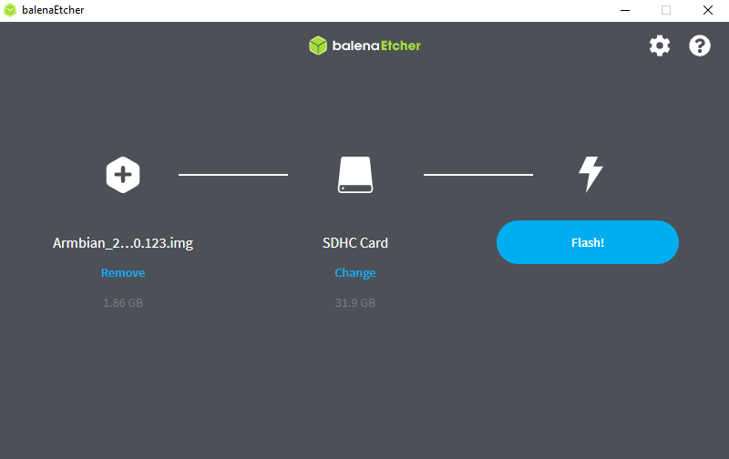
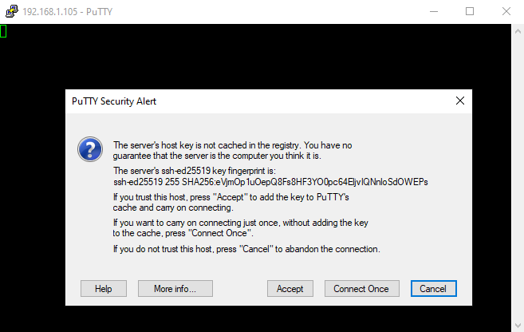
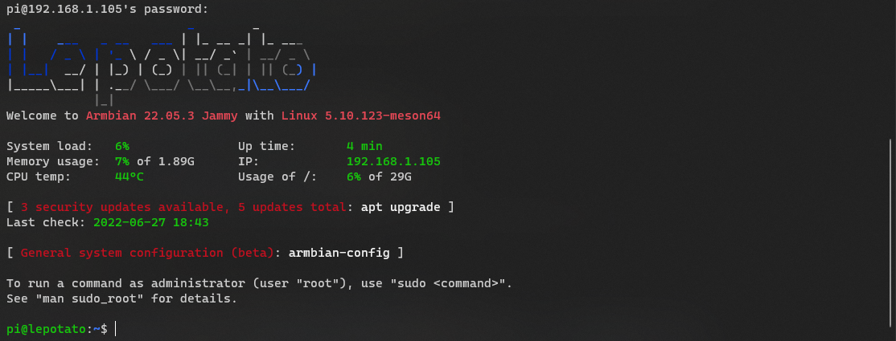
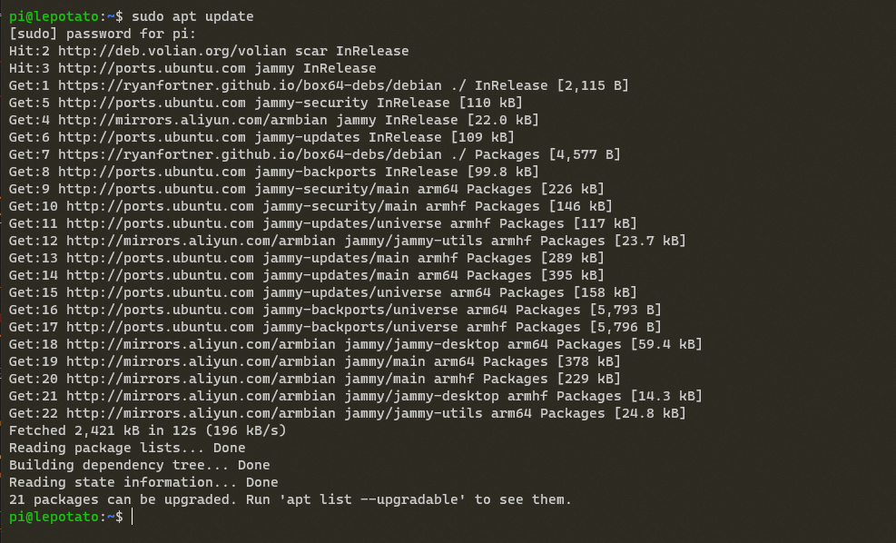
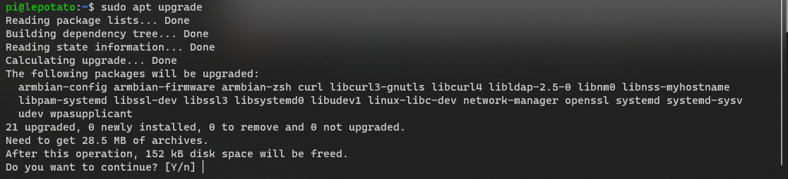
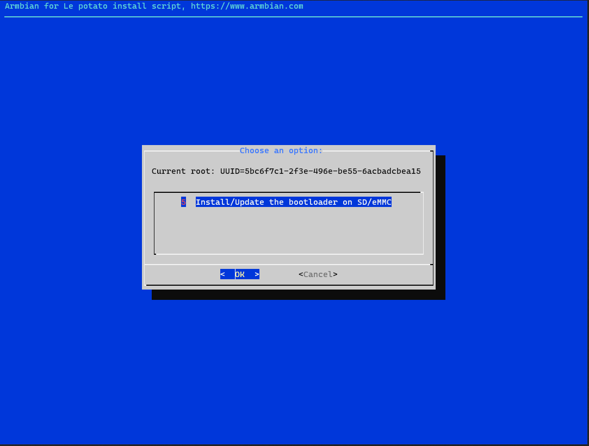
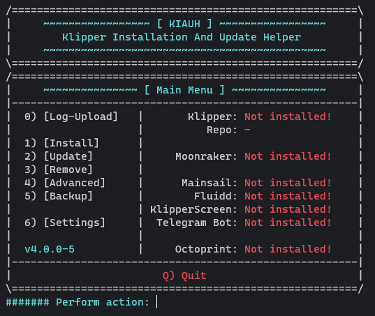

# Installing Armbian and Klipper on Le Potato (AML-S905X-CC)



## Notes

 - Le Potato does not have WiFi.  An ethernet connection is required.


## Armbian Installation

 Le Potato is supported by the Armbian project.  Download the latest supported version from here: https://www.armbian.com/lepotato/.  
 The CLI version is recommended, as a full desktop environment is not necessary to run klipper.  
 
 


 Use [balenaEtcher](https://www.balena.io/etcher/) or [USBImager](https://gitlab.com/bztsrc/usbimager) 
 to write the image to an SD Card.  A Good, reliable and fast SD card is highly recommended.

 


 When the flashing process is complete, remove the SD card, and insert it into Le Potato.  Connect an ethernet cable, and 5V power over microUSB.
 
 The first boot can be very slow, be patient.  After several minutes, Le Potato should come online.


## Initial Setup

The rest of the setup will be done via SSH connection.  You will need a suitable SSH client.  
[Putty](https://www.chiark.greenend.org.uk/~sgtatham/putty/latest.html) is a popular choice on Windows.  
Mac OS and Linux should have `ssh` preinstalled.

You will need the IP Address of Le Potato.  You can obtain this from your Router's DHCP Lease table.  
The specifics of this are unique for every router, and outside the scope of this documentation.

connect to Le Potato's IP Address with your ssh client.  You may be warned about the identity of the server you are connecting to.  
This is normal the first time.  click accept if necessary.




Log in with username `root` and password `1234` as these are the defaults for new Armbian installations.  

After the first successful login, you will be prompted to change the root password, and guided through creation of a new non-root user account.  
For the sake of consistency and compatibility with existing documentation, we will choose `pi` as the new username.  

When this is finished you will be presented with a command prompt: `root@lepotato:~$`  At this point it is recommended to close the ssh connection
and reconnect using your newly created username.




## System Updates

You should update the system packages before proceeding.  Run the following commands:

`sudo apt update`




`sudo apt upgrade`



Enter `Y` to confirm, and the upgrade process will begin.  This may take a while.


It's necessary to update the u-boot bootloader on the SD Card after armbian system updates.  
run `sudo armbian-config` and browse to `System` -> `Install` then choose `Install/Update the bootloader on SD/eMMC`



Congratulations! you now have a fully functional and up-to-date Potato!  The rest of this document covers installation of kiauh and usage of it to install Klipper and Moonraker.

## kiauh

Connect to Le Potato via ssh and run the following commands:

```
cd ~
git clone https://github.com/th33xitus/kiauh.git
```

this will clone the latest version of the kiauh script into to `kiauh` folder in your home directory (/home/pi/kiauh in our case)

to execute kiauh run `./kiauh/kiauh.sh` and you will be presented with a menu similar to this:



Choose `1` for `Install`, and proceed to install Klipper, Moonraker, and the frontend of your choice (Fluidd or Mainsail are recommended)

## Done!

You can now proceed to the [Voron Documentation](https://docs.vorondesign.com/build/software/configuration.html) to complete the configuration.